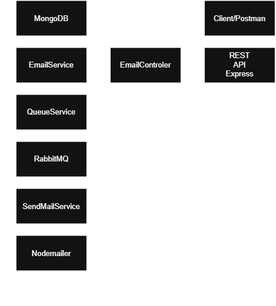

# MailScheduler

API REST para agendamento e processamento de envio de e-mails utilizando **Node.js**, **Express**, **MongoDB**, **RabbitMQ** e **Nodemailer**.

O projeto foi desenvolvido com foco em separar as responsabilidades da aplicação: a API recebe o agendamento, o MongoDB armazena os dados, o `QueueService` identifica e publica os e-mails que já podem ser processados, o RabbitMQ atua como fila de mensagens e o `SendMailService` realiza o envio através do Nodemailer.

## Arquitetura



### Fluxo da aplicação

1. O cliente envia uma requisição para a API REST.
2. O Express encaminha a requisição para o `EmailController`.
3. O `EmailController` chama o `EmailService`.
4. O `EmailService` valida os dados e salva o e-mail no MongoDB.
5. O `QueueService` consulta periodicamente os e-mails pendentes.
6. Os IDs dos e-mails que já atingiram o horário de envio são publicados no RabbitMQ.
7. O `SendMailService` consome a mensagem da fila e recupera os dados completos do e-mail no MongoDB.
8. O Nodemailer envia o e-mail através do SMTP do Gmail.
9. Após o envio, o registro do e-mail é removido do MongoDB.

## Tecnologias

| Tecnologia | Função |
|---|---|
| Node.js | Runtime da aplicação |
| Express | API REST e roteamento HTTP |
| MongoDB | Persistência dos e-mails agendados |
| Mongoose | Comunicação com o MongoDB |
| RabbitMQ | Fila e processamento assíncrono |
| amqplib | Cliente AMQP utilizado pelo Node.js |
| Nodemailer | Envio dos e-mails via SMTP |
| Gmail SMTP | Servidor responsável pelo envio |
| dotenv | Carregamento das variáveis de ambiente |
| CORS | Configuração de requisições cross-origin |
| Nodemon | Reinicialização automática em desenvolvimento |

> O `package.json` ainda possui dependências relacionadas a SQS/BullMQ (`@aws-sdk/client-sqs`, `bullmq` e `ioredis`) que não participam do fluxo atual da aplicação. O processamento implementado atualmente utiliza RabbitMQ.

## Pré-requisitos

Antes de executar o projeto, instale e configure:

- **Node.js**
- **MongoDB Atlas** ou uma instância MongoDB compatível com a URL utilizada em `src/config/DbConfig.js`
- **RabbitMQ Server** local, executando em `amqp://localhost`
- Uma conta do **Gmail** com credenciais SMTP válidas. Para contas que utilizam autenticação em duas etapas, recomenda-se usar uma senha de aplicativo.

## Instalação

Clone o projeto e entre na pasta:

```bash
git clone https://github.com/kauax-vinicius-dev/MailScheduler.git
cd MailScheduler
```

Instale as dependências:

```bash
npm install
```

## Variáveis de ambiente

Crie um arquivo `.env` na raiz do projeto:

```env
PORT=3000

DB_USERNAME=seu_usuario_mongodb
DB_PASSWORD=sua_senha_mongodb

SMTP_USER=seu_email@gmail.com
SMTP_PASS=sua_senha_ou_app_password
```

O arquivo `.env` não deve ser versionado. O projeto já o inclui no `.gitignore`.

### Observação sobre o MongoDB

Atualmente, a URL de conexão está definida diretamente em `src/config/DbConfig.js` e utiliza as variáveis `DB_USERNAME` e `DB_PASSWORD`:

```text
mongodb+srv://<DB_USERNAME>:<DB_PASSWORD>@cluster-1.vxhqtsw.mongodb.net/?appName=Cluster-1
```

Caso o seu cluster utilize outro host ou outro formato de conexão, ajuste esse arquivo.

## Executando o RabbitMQ

O projeto espera encontrar o RabbitMQ localmente em:

```text
amqp://localhost
```

A fila utilizada pela aplicação é:

```text
emailQueue
```

A fila é criada como durável e utiliza o tipo `quorum`.

Depois de instalar o RabbitMQ, confirme que o serviço está em execução antes de iniciar a aplicação.

Caso o plugin de gerenciamento esteja habilitado, normalmente o painel fica disponível em:

```text
http://localhost:15672
```

## Executando a aplicação

Modo desenvolvimento:

```bash
npm run dev
```

O script utiliza o Nodemon e executa:

```text
src/app.js
```

O processo de inicialização realiza, nesta ordem:

1. conexão com o MongoDB;
2. conexão com o RabbitMQ;
3. teste da conexão do Nodemailer com o SMTP;
4. processamento inicial da fila;
5. início do consumer do RabbitMQ;
6. processamento periódico da fila a cada 60 segundos;
7. inicialização do servidor HTTP.

## Endpoints

### Criar um e-mail

**POST** `/email`

Exemplo de requisição:

```json
{
  "recipient": "destinatario@email.com",
  "subject": "Teste do MailScheduler",
  "body": "Este é um e-mail enviado pelo MailScheduler.",
  "sendAt": "2026-08-14T15:30:00.000-03:00"
}
```

Exemplo com cURL:

```bash
curl -X POST http://localhost:3000/email \
  -H "Content-Type: application/json" \
  -d '{
    "recipient": "destinatario@email.com",
    "subject": "Teste do MailScheduler",
    "body": "Este é um e-mail enviado pelo MailScheduler.",
    "sendAt": "2026-08-14T15:30:00.000-03:00"
  }'
```

Resposta esperada:

```json
{
  "message": "Email registered successfully."
}
```

### Excluir um e-mail

**DELETE** `/email`

A implementação atual espera o ID do MongoDB diretamente no corpo da requisição.

Exemplo:

```bash
curl -X DELETE http://localhost:3000/email \
  -H "Content-Type: application/json" \
  -d '"SEU_ID_DO_MONGODB"'
```

Resposta esperada:

```json
{
  "message": "Email deleted successfully."
}
```

## Estrutura de pastas

```text
MailScheduler/
├── .env
├── .gitignore
├── package.json
├── package-lock.json
├── README.md
├── mailScheduler.drawio.png
└── src/
    ├── app.js
    │
    ├── config/
    │   ├── DbConfig.js
    │   ├── NodemailerConfig.js
    │   └── Rabbitmq.js
    │
    ├── controllers/
    │   └── EmailController.js
    │
    ├── models/
    │   └── emailModel.js
    │
    ├── routes/
    │   └── routes.js
    │
    ├── services/
    │   ├── EmailService.js
    │   ├── QueueService.js
    │   └── SendMailService.js
    │
    └── utils/
        └── InputValidator.js
```

## Responsabilidade das pastas

### `src/config/`

Contém configurações e integrações externas da aplicação.

- `DbConfig.js`: cria a conexão com o MongoDB usando Mongoose.
- `Rabbitmq.js`: conecta ao RabbitMQ, publica mensagens e consome mensagens da fila.
- `NodemailerConfig.js`: configura o transporter SMTP e realiza o envio através do Nodemailer.

### `src/controllers/`

Responsável por receber as requisições HTTP e devolver as respostas para o cliente.

- `EmailController.js`: recebe as operações de criação e exclusão de e-mails e delega as regras para o `EmailService`.

### `src/models/`

Define a estrutura dos dados persistidos no MongoDB.

- `emailModel.js`: modelo `Email`, com os campos `recipient`, `subject`, `body`, `sendAt` e `isSent`.

### `src/routes/`

Define os endpoints da API.

- `routes.js`: registra as rotas `POST /email` e `DELETE /email`.

### `src/services/`

Contém as regras de negócio e o fluxo principal da aplicação.

- `EmailService.js`: cria, remove, consulta e atualiza os registros de e-mail.
- `QueueService.js`: identifica e-mails cujo horário de envio chegou, publica seus IDs no RabbitMQ e mantém o consumer ativo.
- `SendMailService.js`: recebe o ID consumido da fila, busca o e-mail no banco, envia pelo Nodemailer e remove o registro após o envio.

### `src/utils/`

Contém funções auxiliares reutilizáveis.

- `InputValidator.js`: verifica campos vazios e possui validadores auxiliares para strings e e-mails.

## Como funciona o agendamento

O agendamento é baseado no campo `sendAt`.

O `QueueService` busca registros com:

```text
isSent = false
sendAt <= data/hora atual
```

Para cada registro encontrado:

```text
MongoDB
   ↓
QueueService
   ↓
RabbitMQ
   ↓
SendMailService
   ↓
Nodemailer
   ↓
SMTP Gmail
```

A verificação da fila ocorre na inicialização da aplicação e, depois, a cada **60 segundos**.

Isso significa que o envio não é disparado diretamente pela requisição de criação. A requisição apenas registra o agendamento; o processamento é feito posteriormente pelo fluxo de fila.

## RabbitMQ

O RabbitMQ desacopla a identificação dos e-mails prontos para envio da etapa responsável pelo envio.

O produtor é o `QueueService`:

```text
QueueService → RabbitMQ
```

O consumidor é iniciado pelo próprio `QueueService`, mas o processamento da mensagem é delegado ao `SendMailService`:

```text
RabbitMQ → SendMailService
```

A aplicação utiliza mensagens persistentes e confirmações do canal para publicação.

## Nodemailer

O Nodemailer é configurado em `src/config/NodemailerConfig.js` com o SMTP do Gmail:

```text
smtp.gmail.com:587
```

Antes de iniciar o servidor HTTP, a aplicação executa `transporter.verify()` para verificar se a conexão SMTP está funcionando.

## Modelo de dados

Cada e-mail possui atualmente a seguinte estrutura:

```json
{
  "recipient": "destinatario@email.com",
  "subject": "Assunto",
  "body": "Conteúdo",
  "sendAt": "2026-08-14T15:30:00.000Z",
  "isSent": false
}
```

### Campos

| Campo | Tipo | Descrição |
|---|---|---|
| `recipient` | String | Endereço do destinatário |
| `subject` | String | Assunto do e-mail |
| `body` | String | Conteúdo textual do e-mail |
| `sendAt` | Date | Data e hora programadas para envio |
| `isSent` | Boolean | Indica se o registro já foi retirado do fluxo de pendências |

> No código atual, `isSent` também é alterado para `true` no momento em que o ID é publicado na fila. Portanto, o nome representa o estado usado pelo fluxo atual e não necessariamente uma confirmação final de entrega pelo servidor SMTP.

## Tratamento de erros

A aplicação possui `try/catch` principalmente nas camadas de integração e processamento:

- conexão com MongoDB;
- conexão com RabbitMQ;
- verificação do Nodemailer;
- processamento da fila;
- consumo das mensagens;
- envio do e-mail;
- operações dos controllers.

Erros de requisição são retornados pelo controller com status HTTP `400`.

## Possíveis melhorias futuras

Alguns pontos podem evoluir conforme o projeto crescer:

- separar os estados `queued`, `sent` e `failed` em vez de utilizar apenas `isSent`;
- manter o registro do e-mail após o envio, caso seja necessário histórico ou auditoria;
- adicionar retry/dead-letter queue no RabbitMQ para falhas de envio;
- validar efetivamente o endereço de e-mail antes de salvar, utilizando o método `isEmailValid` já existente;
- mover a string de conexão do MongoDB para uma variável de ambiente;
- adicionar testes automatizados;
- documentar a API com Swagger/OpenAPI;
- remover dependências que não fazem parte do fluxo atual, caso não sejam utilizadas futuramente;
- criar uma rota específica para consultar o status de um agendamento.

## Troubleshooting

### `Failed to connect to RabbitMQ`

Verifique se o RabbitMQ Server está em execução e aceitando conexões em:

```text
amqp://localhost
```

### `MongoDB connection error`

Confirme `DB_USERNAME`, `DB_PASSWORD` e as permissões do usuário do MongoDB Atlas. Também verifique se o endereço IP da máquina está liberado nas regras de rede do cluster.

### `Verification nodemailer failed`

Confirme `SMTP_USER` e `SMTP_PASS`. Para contas Gmail com autenticação em duas etapas, use uma senha de aplicativo em vez da senha normal da conta.

### A aplicação inicia, mas não envia o e-mail imediatamente

O sistema verifica os e-mails pendentes a cada 60 segundos. Além disso, o `sendAt` precisa ser menor ou igual ao horário atual no momento em que a fila for processada.

## Scripts

| Comando | Função |
|---|---|
| `npm install` | Instala as dependências |
| `npm run dev` | Inicia a aplicação em modo desenvolvimento com Nodemon |

## Licença

Este projeto utiliza atualmente a licença `ISC`, conforme definido no `package.json`.

## Autor

**Kauã Vinicius Alves da Silva**

Projeto desenvolvido como estudo prático de **Node.js, APIs REST, persistência com MongoDB, mensageria com RabbitMQ e envio de e-mails via SMTP**.
